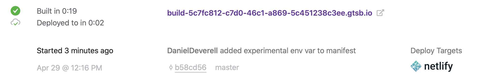
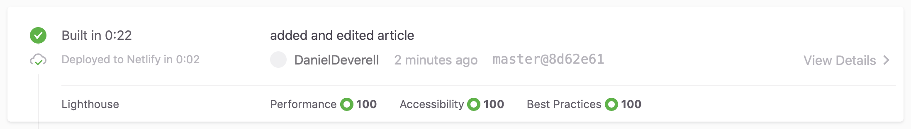

Since I was using an old template I went ahead and updated all dependencies only to find that Helmet was now a named export.

(I really need to update this template by building my own from scratch.)

Found the official documentation [here](https://www.gatsbyjs.org/docs/page-build-optimizations-for-incremental-data-changes/)! 

So I need to set an environment variable in my build command:
```js
GATSBY_EXPERIMENTAL_PAGE_BUILD_ON_DATA_CHANGES=true
``` 

Let's see how this is handled in Gatsby.

```js
"scripts": {
  "build": "gatsby build GATSBY_EXPERIMENTAL_PAGE_BUILD_ON_DATA_CHANGES=true",
  "develop": "gatsby develop",
  "dev": "gatsby develop",
  "format": "prettier --write \"**/*.{js,jsx,json,md}\"",
  "start": "npm run develop",
  "serve": "gatsby serve",
  "clean": "gatsby clean",
  "test": "echo \"Write tests! -> https://gatsby.dev/unit-testing\" && exit 1"
}
```

OK, 5 seconds later I'd say that was a longer build than usual.

Adding `--log-pages` and `--write-to-file` and running `yarn build`.

Nothing to remark on in the log. No additional logging, no `newPages.txt` or `deletedPages.txt` in `.cache`. Probably because I haven't created any new pages. But I DID edit this one. 

```sh
success Re-building development bundle - 0.896s
info changed file at /Users/danieldeverell/Desktop/_personal/content/blog/incremental-builds/index.md
success createPages - 0.037s
success run queries - 0.146s - 2/2 13.74/s
success write out requires - 0.008s
info changed file at /Users/danieldeverell/Desktop/_personal/content/blog/incremental-builds/index.md
info changed file at /Users/danieldeverell/Desktop/_personal/content/blog/incremental-builds/index.md
success createPages - 0.015s
info changed file at /Users/danieldeverell/Desktop/_personal/content/blog/incremental-builds/index.md
success run queries - 0.087s - 2/2 22.90/s
success write out requires - 0.005s
info changed file at /Users/danieldeverell/Desktop/_personal/content/blog/incremental-builds/index.md
success createPages - 0.011s
success run queries - 0.062s - 2/2 32.31/s
success write out requires - 0.004s
[============================]   247.480 s 6/6 100% Generating image thumbnails
```

Let's push this sucker.



Make some small edits to an article.

Let's push this sucker.



Nada, zilch, nothing. Time for a webinar! 

GoToWebinar - This Changes Everything: Incremental Builds in Gatsby